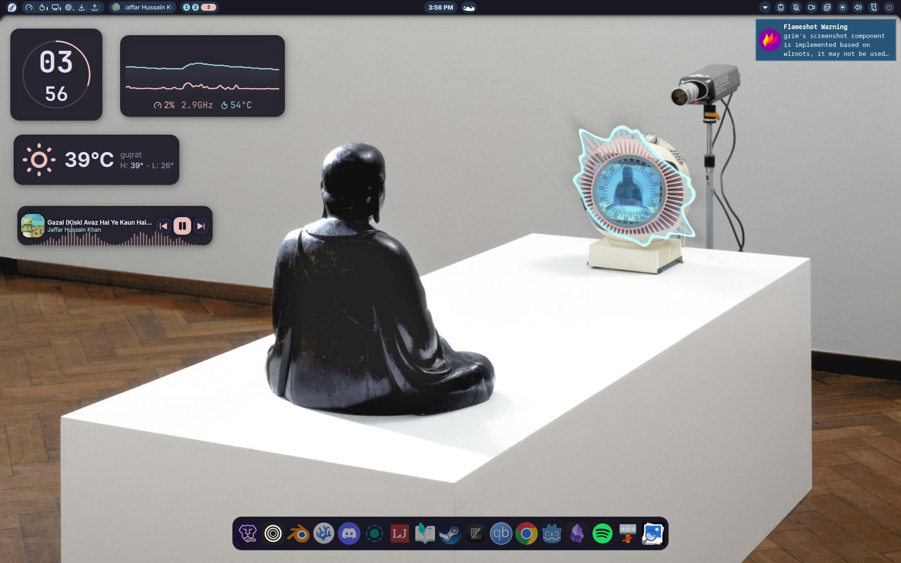
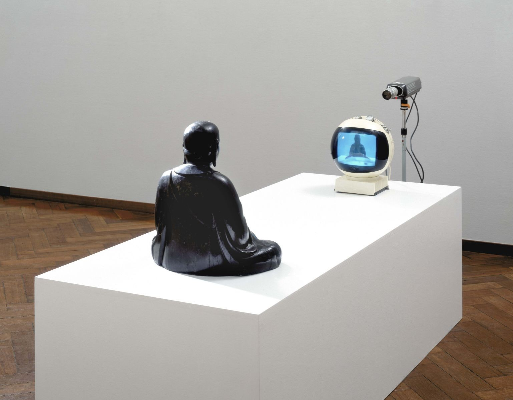

# My Dotfiles

This directory contains the dotfiles for my system

## Requirements

Ensure you have the following installed on your system

### Git

```
sudo dnf install git
```

### Stow

```
sudo dnf install stow
```

## Installation

First, check out the dotfiles repo in your `$HOME` directory using git

```
$ git clone git@github.com/effectforward/dotfiles.git
$ cd dotfiles
```

Before stowing, pre-create any directories that should not be symlinked wholesale:

```
$ mkdir -p ~/.config ~/scripts
```

Then use GNU stow to create symlinks:

```
$ stow .
```

## What's Tracked

| Path | Description |
|------|-------------|
| `.bashrc` | Bash shell config |
| `.config/alacritty.toml` | Alacritty terminal config |
| `.config/niri/config.kdl` | Niri compositor config |
| `.config/starship.toml` | Starship prompt config |
| `.config/starship_Tokyo_night.toml` | Starship Tokyo Night theme preset |
| `.config/noctalia/settings.json` | Noctalia shell layout & widget config |
| `.config/noctalia/colors.json` | Active color palette |
| `.config/noctalia/plugins.json` | Installed plugins list |
| `.config/noctalia/user-templates.toml` | User theming templates |
| `scripts/fix-spicetify.sh` | Spicetify fix script |

## Desktop Preview



**Wallpaper:** [Buddha](https://whvn.cc/j83emp)



## Watch This Video For More Information

[](https://www.youtube.com/watch?v=y6XCebnB9gs)